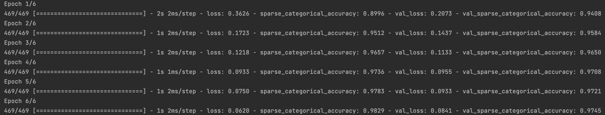

# Use MLflow to Manage an ML Project

## Goal

> Duke University IDS 706 Weekly Mini Project 12

## Preparation

1. Python 3.9.0 or above
2. Tensorflow 2.5.0 or above
3. mlflow 1.19.0 or above
2. Set Up MLflow: Install MLflow (pip install mlflow). Ensure you have an MLflow tracking server or use the default local file system to store data. 
2. Run the Project: Execute main.py. It will run the model and track the experiment with MLflow.
3. view and load ML models saved in `mlruns` folder

## Run and Result

This project I use the `mnist` dataset to train a simple CNN model. The model is saved in `mlruns` folder.

The training progress is shown below:

## Reference

1.  https://github.com/nogibjj/python-template
2.  https://github.com/helenyjx/Rust-Powered-Calculator-Microservice-in-the-Cloud

